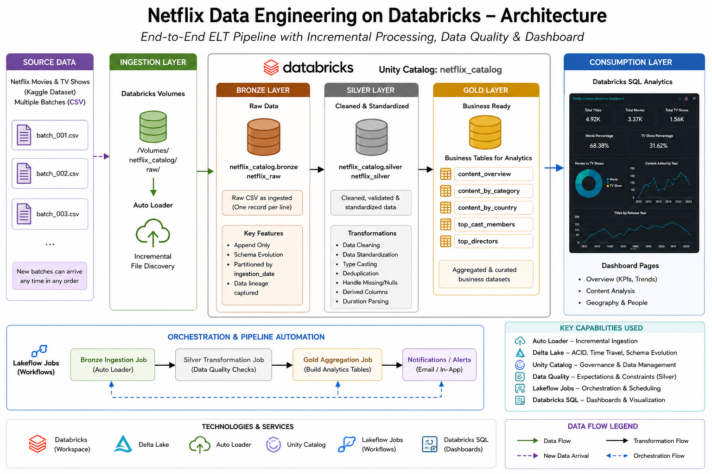
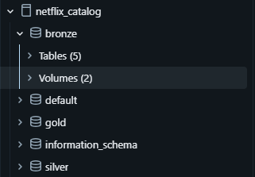
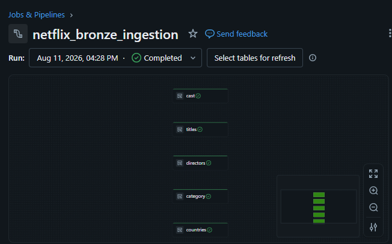
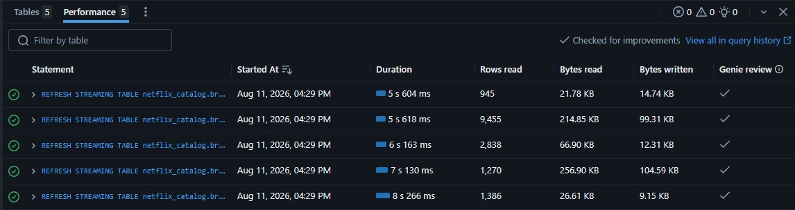
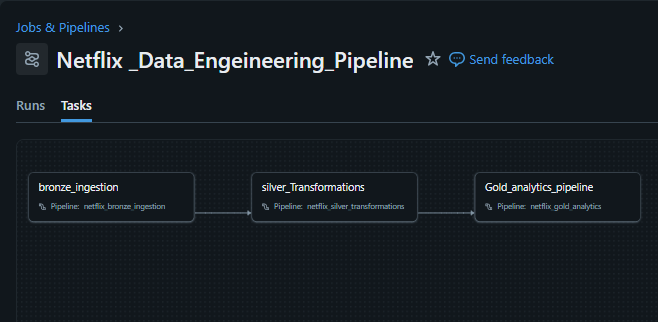
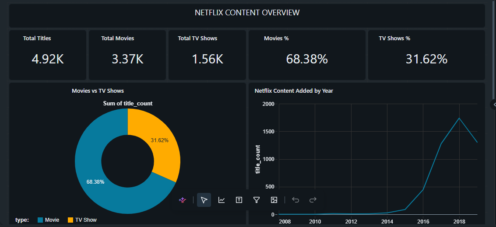
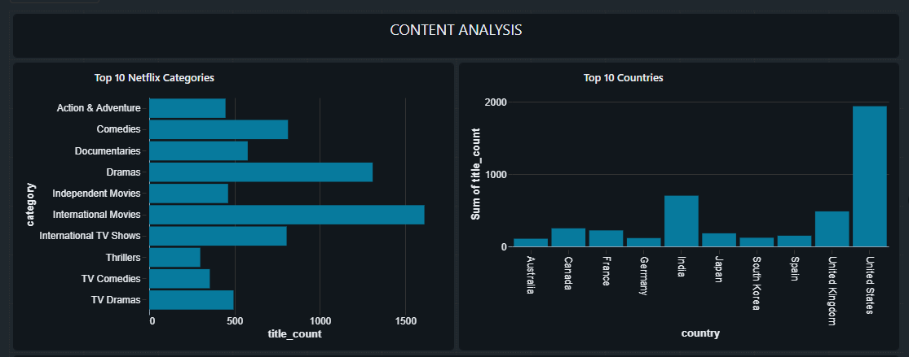
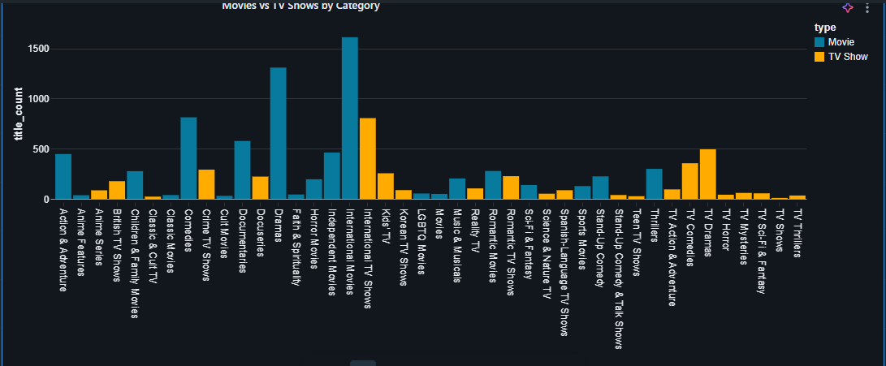

# Netflix Data Engineering Pipeline

An end-to-end **Data Engineering project built with modern Databricks** to process Netflix catalog data using incremental ingestion, Medallion Architecture, data quality checks, Lakeflow orchestration, and Databricks SQL.

## Architecture



## Data Flow

```text
Netflix CSV Batches
        ↓
Databricks Volume
        ↓
Auto Loader
        ↓
Bronze
        ↓
Silver + Data Quality
        ↓
Gold
        ↓
Databricks SQL Dashboard
```

## Project Overview

The project uses a public Netflix catalog dataset consisting of five CSV files:

- `netflix_titles.csv`
- `netflix_cast.csv`
- `netflix_category.csv`
- `netflix_countries.csv`
- `netflix_directors.csv`

The source files are divided into multiple batches to simulate incremental data arrival.

The batches are uploaded directly to a **Databricks Volume** and ingested using **Auto Loader**.

## Medallion Architecture

### Bronze Layer

The Bronze layer performs incremental ingestion of the source CSV files.

Five Bronze streaming tables are created:

```text
netflix_catalog.bronze
├── titles
├── cast
├── category
├── countries
└── directors
```

### Silver Layer

The Silver layer performs data cleaning, standardization, and quality validation.

Key processing includes:

- Data type conversion
- Whitespace cleanup
- Null and empty-value handling
- Duplicate handling
- Value standardization
- Relationship validation

Five Silver tables are created from the Bronze layer.

### Gold Layer

The Gold layer contains business-ready datasets for analytical consumption:

```text
content_overview
content_by_country
content_by_category
top_cast_members
top_directors
```

## Data Quality

Data quality checks were performed during Silver transformations, including:

- Null and empty-value checks
- Duplicate checks
- Whitespace checks
- Valid-value checks
- Relationship integrity checks
- Orphan record checks

The Silver results were validated before creating the Gold layer.

## Orchestration

The three main pipelines are orchestrated using **Lakeflow Jobs**:

```text
Bronze Ingestion
       ↓
Silver Transformations
       ↓
Gold Analytics
```

This ensures that each layer is processed only after its upstream layer completes successfully.

## Incremental Processing

The pipeline was tested by uploading source batches sequentially.

Newly uploaded files were detected and processed incrementally through the Bronze, Silver, and Gold layers.

This demonstrates the incremental ingestion behavior of Auto Loader.

## Databricks SQL Dashboard

The Gold layer is consumed directly through a **Databricks SQL Dashboard**.

The dashboard provides a simple view of:

- Total titles
- Movies vs TV Shows
- Content added over time
- Category analysis
- Other Gold-layer analytics

The dashboard is included to demonstrate consumption of the Gold layer rather than as a separate BI project.

## Technologies

- **Databricks**
- **Unity Catalog**
- **Auto Loader**
- **Lakeflow Declarative Pipelines**
- **Lakeflow Jobs**
- **Apache Spark / PySpark**
- **Databricks SQL**
- **Delta Lake**
- **GitHub**

## Repository Structure

```text
Netflix_Data_Engineering_Pipeline/
│
├── architecture/
│   └── Netflix_databricks_architecture.png
│
├── scripts/
│   ├── bronze_ingestion.py
│   ├── silver_transformations.py
│   └── gold_transformations.py
│
├── sql/
│   └── dashboard_queries.sql
│
├── docs/
│   ├── data_flow.md
│   ├── data_quality.md
│   └── orchestration.md
│
└── screenshots/
    ├── catalog_structure.png
    ├── bronze_pipeline.png
    ├── silver_pipeline.png
    ├── gold_pipeline.png
    ├── orchestration.png
    ├── incremental_processing.png
    └── dashboard.png
```

## Project Evidence

### Databricks Catalog



### Bronze Ingestion



### Silver Transformations



### Lakeflow Job Orchestration



### Databricks SQL Dashboard





## Documentation

- [Data Flow](docs/data_flow.md)
- [Data Quality](docs/data_quality.md)
- [Orchestration](docs/orchestration.md)

## Key Engineering Concepts Demonstrated

- Incremental file ingestion using Auto Loader
- Medallion Architecture
- Bronze, Silver, and Gold data layers
- Data quality validation
- Streaming and batch processing patterns
- Lakeflow Declarative Pipelines
- Lakeflow Jobs orchestration
- Gold-layer analytical modeling
- Databricks SQL consumption
- Unity Catalog organization
- Git-based project versioning
